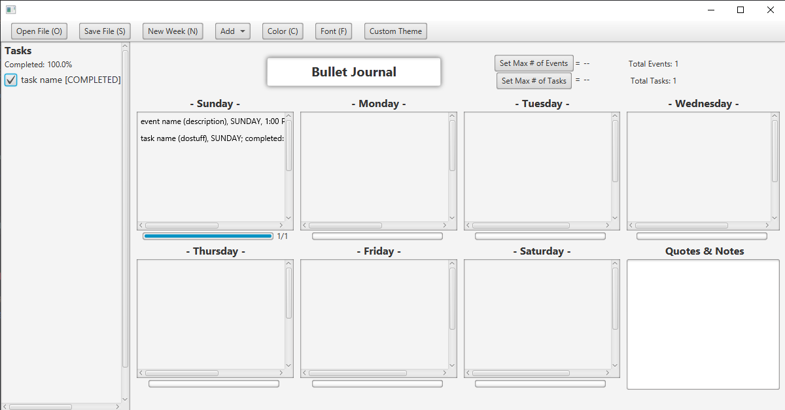

# 3500 PA05 Project Repo

[PA Write Up](https://markefontenot.notion.site/PA-05-8263d28a81a7473d8372c6579abd6481)

Your bullet journal!
- organize events and tasks
- save and open past bullet journals
- customize appearance

## runnable .jar file
download pa05-template.jar in repo and open to run
(https://github.com/CS-3500-OOD/pa05-juliepenelopepercy/blob/main/pa05-template.jar)

## Solid principles
- S: Each class has one responsibility. We separated the controller from the view by making separate classes. We also have one just to represent an event, another to represent a task, and another to represent all the week's content. 
- O: TaskJson and EventJson cannot be modified since they are records but can be extended (i.e. if we wanted to make a SchoolEvent in the future or a HomeworkTask, we could and it would be trivial to add it to our bullet journal)
- L: The EmptyApplication class in our test folder extends the Application class. Substituting Application with EmptyApplication will not break the program, thereby adhering to the Liskov Substitution principle.
- I: The two classes that implement the BujoView interface use all the methods given in the interface. This means that there are no irrelevant methods in the view classes that implement the interface. (bullet journal and the splash screen)
- D: When creating a new Day instance, it can take in any DayOfWeek instead of creating its own DayOfWeek. Therefore, DayOfWeek and Day can be created independently, adhering to the Dependency Injection principle.

## Additional Feature -> Themes
We could implement the Themes features fairly easily since we already have the Custom Themes features implemented. Our Custom Themes feature currently allows the user to freely pick a range of features, including the background color and font family. Instead, we could group certain stylistic choices (i.e. blue background color, red menu bar and Arial font) all under one theme and give it a name. Having it persist when saving and opening a .bujo file would also be trivial since we would just need to add a Theme variable to the WeekJson class and make sure to check it whenever we open a .bujo file.

## 
(pencil image) https://clipart-library.com/free/pencil-clipart-transparent-background.html 
